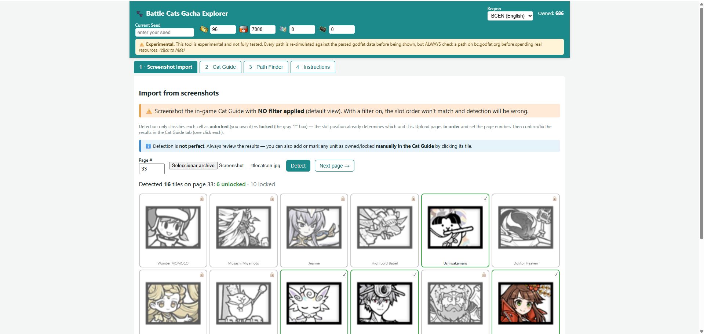
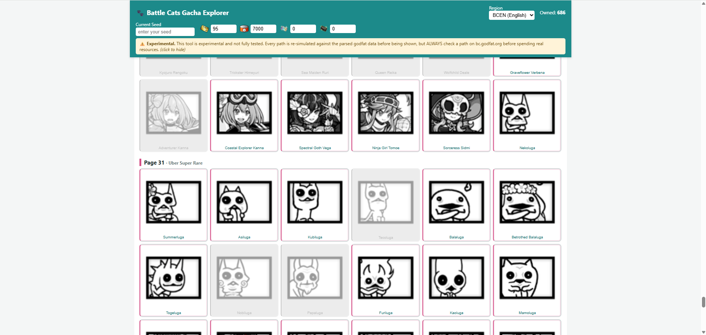
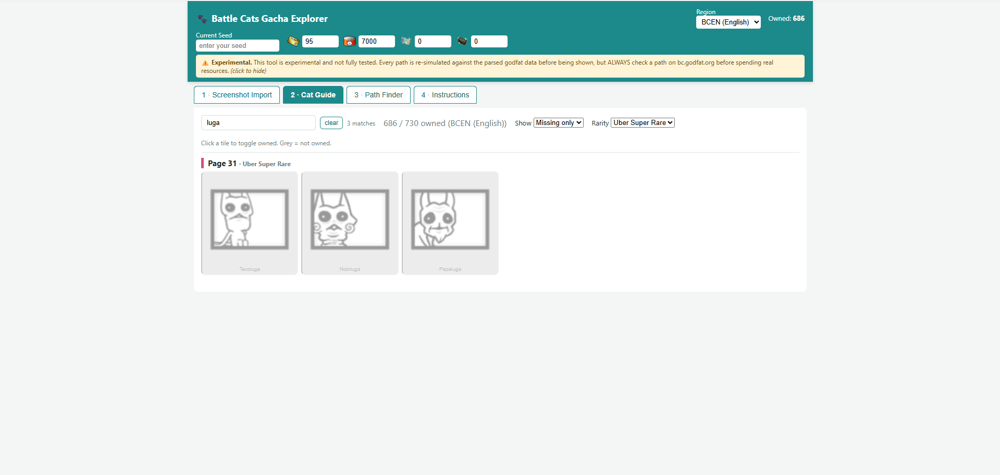
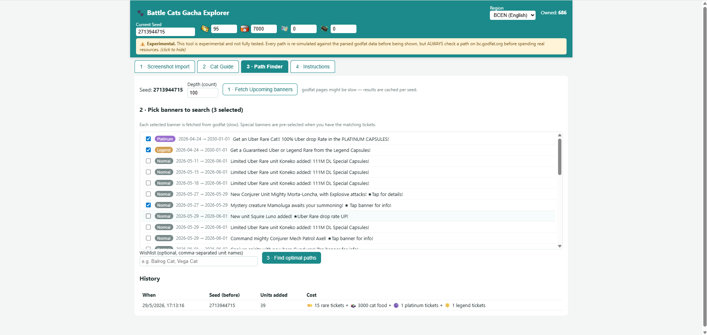
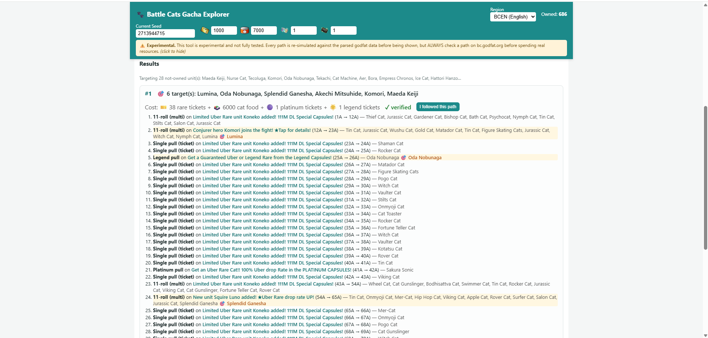
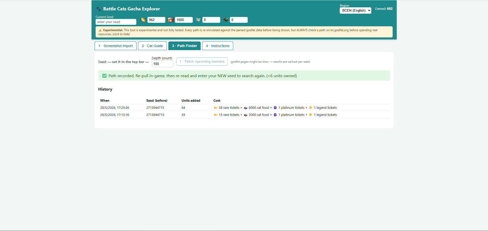

# Battle Cats Gacha Explorer

A web app that helps a Battle Cats player find the **most resource-efficient pull
path** to the units they don't yet own, using godfat seed-tracking data.

> ⚠️ **Experimental and not fully tested.** Every path the app shows is
> re-simulated against the parsed godfat data before display, but **always
> check a path on [bc.godfat.org](https://bc.godfat.org/) before spending real
> resources.**

It has four tabs:

1. **Screenshot Import** — upload screenshots of your in-game Cat Guide; the app
   detects which slots are unlocked vs locked and proposes owned units.
   Detection isn't perfect — review it, then confirm/fix in the Cat Guide.
2. **Cat Guide** — a wiki-style grid mirroring the in-game Cat Guide order where
   you toggle units owned/not-owned (and confirm screenshot results). Includes a
   name search box and owned/rarity filters.
3. **Path Finder** — enter your seed + resources; the app scrapes godfat's
   *Upcoming* banners, computes optimal paths to the units you don't own yet
   (each path ends at its last target), and offers an **"I followed this path"**
   button that records every newly pulled unit as owned, discards the
   now-invalid paths, and prompts you to re-enter your new seed.
4. **Instructions** — an in-app usage guide.

## Screenshots

| Screenshot Import | Cat Guide |
| --- | --- |
|  |  |
| **Cat Guide — search & filters** | **Path Finder — pick banners** |
|  |  |
| **Path Finder — results** | **After “I followed this path”** |
|  |  |

## Prerequisites — read this first

- **You must already be seed-tracking.** This app does **not** derive your seed;
  you provide it. You can find it via [bc-seek.godfat.org/seek](https://bc-seek.godfat.org/seek),
  and re-read it after every pull session.
- **Screenshots must use NO filter.** Screenshot the Cat Guide in its **default
  view with no filter applied**. With a filter on, the slot order won't match the
  master list and detection will be wrong.
- **Region:** only **BCEN (English)** ships with the app today. The master list
  is region-swappable (see [Re-scrapers](#re-scrapers)) but other regions aren't
  bundled yet.

## Quick start (Docker — recommended)

```bash
docker compose up --build
```

- Frontend: http://localhost:5173
- Backend API: http://localhost:8000  (docs at `/docs`)

State (SQLite DB, godfat cache, logs) is persisted in `backend/var/`.

## Resetting / deleting your data

All your state — owned units, seed, resources, and followed-path history — lives
in a single SQLite file at `backend/var/app.sqlite`; cached godfat pages live in
`backend/var/godfat_cache/`. Both Docker and local runs use this same folder.

To wipe everything and start fresh, stop the app and delete them:

```bash
rm -f  backend/var/app.sqlite       # owned units / seed / resources / history
rm -rf backend/var/godfat_cache     # cached godfat pages (optional)
```

```powershell
# PowerShell
Remove-Item backend\var\app.sqlite -Force
Remove-Item backend\var\godfat_cache -Recurse -Force
```

The database is recreated empty on the next start. To only clear owned units
(keeping seed/resources/history), call `POST /api/owned/clear`.

## Quick start (local, without Docker)

Requires **Python 3.11** and **Node 20 + pnpm**.

```bash
# backend
python -m venv backend/.venv
backend/.venv/Scripts/pip install -r backend/requirements.txt      # Windows
# backend/.venv/bin/pip install -r backend/requirements.txt        # macOS/Linux
backend/.venv/Scripts/uvicorn app.main:app --reload --port 8000    # (run from backend/)

# frontend (in another terminal)
cd frontend
pnpm install
pnpm dev
```

The Vite dev server proxies `/api` to the backend on port 8000.

`make dev` / `make install` / `make test` wrap these (see the `Makefile`).

## How a typical session goes

1. **Cat Guide** tab — mark what you already own (or use Screenshot Import to
   bulk-fill, then fix any mistakes with one click). Use the search box to find
   units quickly.
2. Top bar — enter your **seed** and your **resources** (rare tickets, cat food,
   platinum tickets, legend tickets).
3. **Path Finder** tab — *Fetch Upcoming banners*, tick the banners to search
   (special Platinum/Legend banners are pre-selected when you have the tickets),
   then *Find optimal paths*. godfat pages can be slow, so results are cached per
   seed; the search button locks until you change a banner/wishlist.
4. Pick a path, pull it in-game, then click **"I followed this path."** Every
   unit on that path is marked owned and your resources are decremented. Re-read
   your new seed in-game and enter it to search again.

### Pull cost model

- A single pull costs **1 rare ticket**; once your tickets run out, single pulls
  cost **150 cat food** (tickets are always spent first).
- An 11-roll (multi) costs **1500 cat food** — including on non-guaranteed
  banners, where it's just 11 consecutive normal pulls (cat food only).
- **Platinum / Legend Capsule** pulls cost **1 platinum / legend ticket** each
  (single guaranteed pulls; no 11-roll, no cat food/tickets). Excluded if you
  have 0 of that ticket.

## Tests

```bash
cd backend && .venv/Scripts/python.exe -m pytest      # 44 tests
```

Covers the pathfinder (4-resource Pareto, platinum/legend mechanics,
tickets-first single pulls, plain 11-rolls on non-guaranteed banners, paths
trimmed to the last target, and re-simulation of every returned solution),
godfat ingestion (offline via a mock transport), name normalisation, persistence
+ the followed-path workflow, the FastAPI surface, and screenshot detection
against two real screenshots at different resolutions.

## Unit icons (offline rendering)

The Cat Guide tiles render from a locally-served icon set in
`frontend/public/icons/` (so the app doesn't hit the wiki CDN on every render,
and works offline). These ~707 icons are **shipped in the repo**. If an icon is
missing locally the UI automatically falls back to the wiki URL.

Regenerate / refresh them (e.g. after swapping the master list for a new region)
with:

```bash
python scrapers/download_icons.py
# or for another region:
python scrapers/download_icons.py --master backend/data/cat_guide_master_<region>.json
```

## Re-scrapers

- **godfat banners:** `python scrapers/scrape_godfat.py --seed SEED --list`
  (or `--out banners.json` to dump parsed tables; reuses the app's polite,
  cached, rate-limited client).
- **Master Cat Guide list** (region-swappable): `python scrapers/update_cat_guide.py
  --url https://battlecats.miraheze.org/wiki/Cat_Guide --region en --output
  backend/data/cat_guide_master.json` (or, if Miraheze blocks the bot, Save the
  page in your browser and pass it with `--input Cat_Guide.html`). Drop a
  `cat_guide_master_<region>.json` into `backend/data/` and the app will offer
  that region in the top-bar selector.

## Project layout

```
backend/
  app/
    pathfinder.py   # search core (4-resource Pareto, platinum/legend, 11-rolls), verify_solution
    godfat.py       # Upcoming-banner scraping (cache + rate limit + backoff)
    names.py        # godfat<->master name normalisation / alias layer
    db.py           # SQLite (owned state, settings, history)
    master.py       # region-swappable master loader
    services.py     # targets, search wiring, followed-path workflow
    vision.py       # screenshot grid detection + locked/unlocked classify
    main.py         # FastAPI app
  data/cat_guide_master.json
  tests/            # 44 tests + fixtures (sample banners + 2 screenshots)
frontend/           # Vite + React (4-tab UI)
  public/icons/     # ~707 unit icons (offline rendering)
  public/top_icons/ # top-bar resource icons
scrapers/           # godfat banners, Cat Guide list, and icon downloader
DECISIONS.md        # assumptions, godfat URL-scheme findings, banner mechanics
```

See [DECISIONS.md](DECISIONS.md) for the reverse-engineered godfat URL scheme,
banner-mechanic confirmations, and other non-obvious choices.

## License

Released into the **public domain** under [The Unlicense](LICENSE) — do whatever
you like with it, no attribution required.

The bundled unit names and icons come from the
[Battle Cats Wiki](https://battlecats.miraheze.org/) and remain subject to their
own terms; The Unlicense covers this project's code, not those third-party assets.
