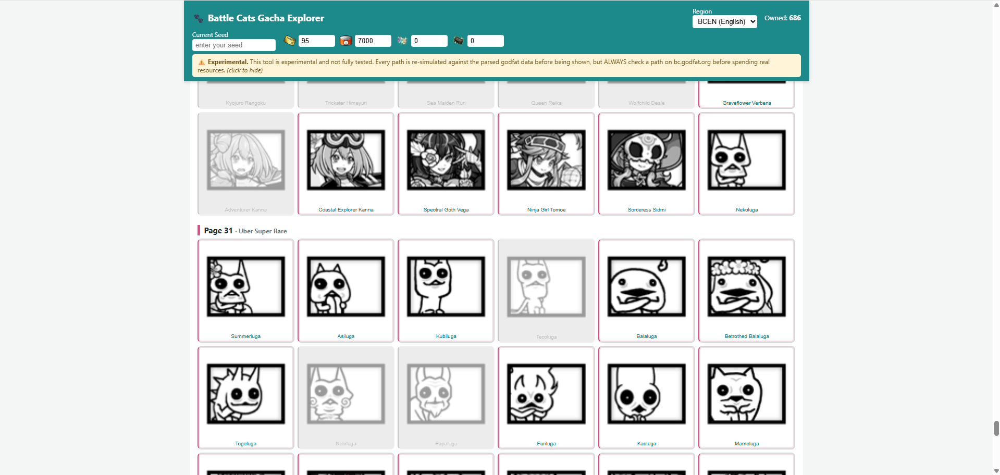
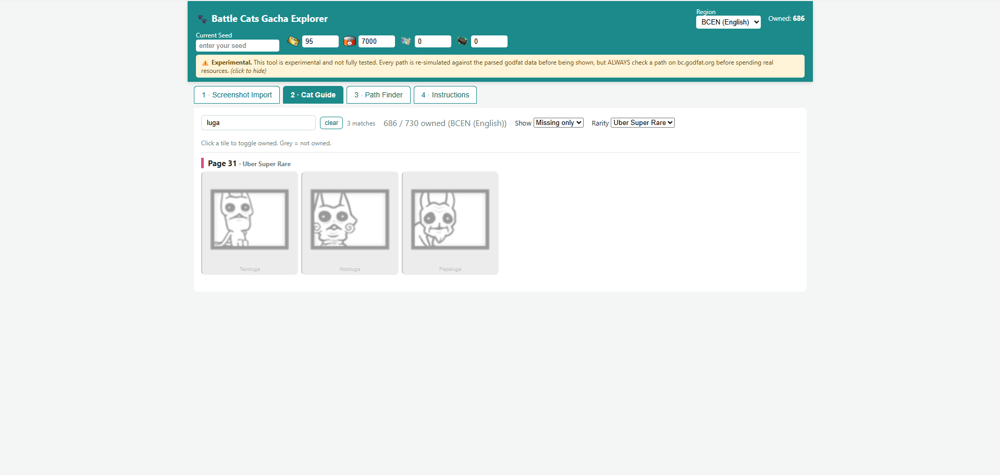
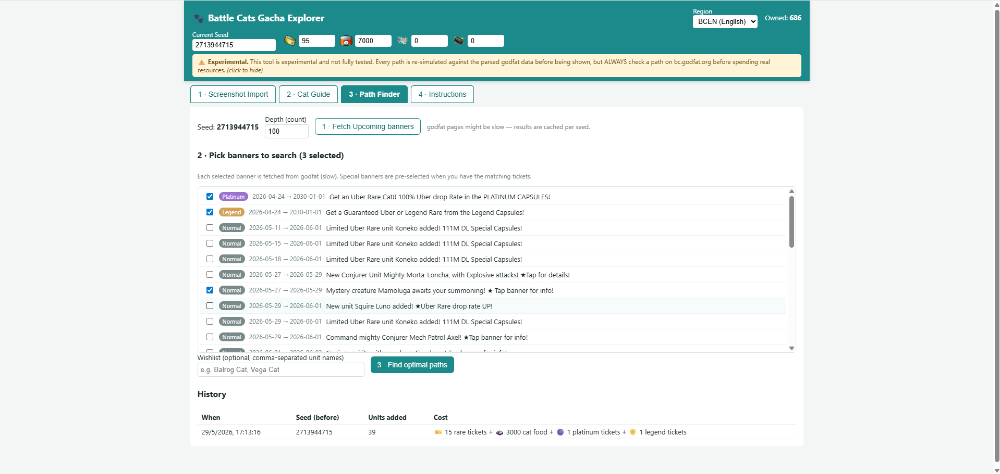
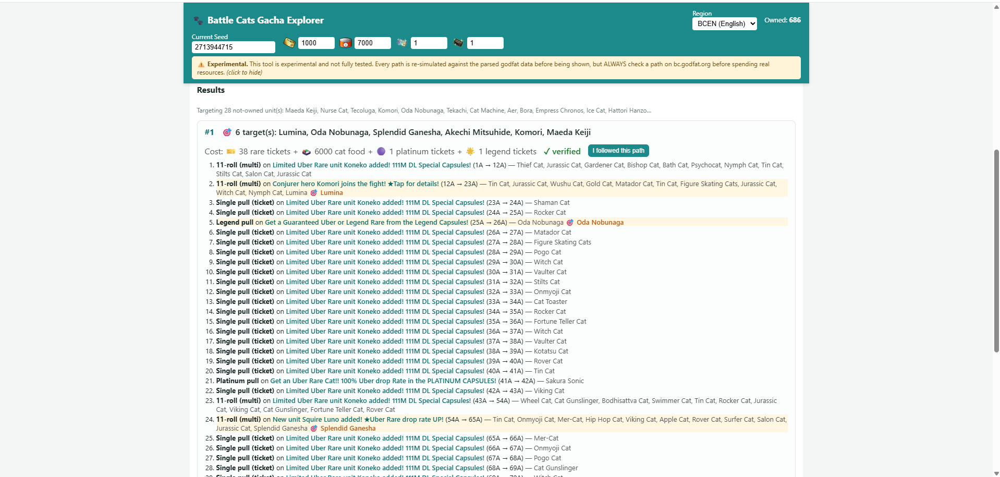

# Battle Cats Gacha Explorer

A web app that helps a Battle Cats player find the **most resource-efficient pull
path** to the units they don't yet own, using godfat seed-tracking data.

> ⚠️ **Experimental and not fully tested.** Every path the app shows is
> re-simulated against the parsed godfat data before display, but **always
> check a path on [bc.godfat.org](https://bc.godfat.org/) before spending real
> resources.**

**Fully stateless / no accounts / no database** — your collection lives entirely
in the page URL (a compact code), so the server stores nothing. It has three tabs:

1. **Cat Guide** — a wiki-style grid mirroring the in-game Cat Guide order where
   you toggle units owned/not-owned. Includes a name search box, owned/rarity
   filters, and copy-link / copy-code / load-code buttons to save your collection.
2. **Path Finder** — enter your seed + resources; the app scrapes godfat's
   *Upcoming* banners, computes optimal paths to the units you don't own yet
   (each path ends at its last target), and offers an **"I followed this path"**
   button that marks every newly pulled unit as owned, decrements your resources,
   and **auto-fills your new seed** (read from godfat's data).
3. **Instructions** — an in-app usage guide.

## Screenshots

| Cat Guide | Cat Guide — search & filters |
| --- | --- |
|  |  |
| **Path Finder — pick banners** | **Path Finder — results** |
|  |  |

## Prerequisites — read this first

- **You must already be seed-tracking.** This app does **not** derive your seed;
  you provide it. You can find it via [bc-seek.godfat.org/seek](https://bc-seek.godfat.org/seek),
  and it's re-filled automatically each time you follow a path.
- **Nothing is stored on any server.** Your owned units, seed, and resources are
  encoded in the page URL — bookmark it (or copy your code) to keep them.
- **Region:** only **BCEN (English)** is supported today. The master list is
  region-swappable (see [Re-scrapers](#re-scrapers)) but other regions aren't
  bundled yet.

## Quick start (Docker — recommended)

```bash
docker compose up --build
```

- Frontend: http://localhost:5173
- Backend API: http://localhost:8000  (docs at `/docs`)

The backend stores **nothing** — no database, no files. godfat pages are cached
in RAM only.

## Your data & privacy

There are no accounts and no server-side storage. Your **owned units, seed, and
resources** are encoded into the page URL (e.g. `…/#o=<code>&s=<seed>&r=…`), so:

- **Bookmark the page** (or use **Copy link** in the Cat Guide) to save everything.
- **Copy code** saves just your owned-units code; **Load a code…** restores it if
  you return without the link.
- To "reset", just open the site without the hash (a fresh URL) — there's nothing
  to delete.

## Quick start (local, without Docker)

Requires **Python 3.11** and **Node 20 + pnpm**.

```bash
# backend
python -m venv backend/.venv
backend/.venv/Scripts/pip install -r backend/requirements.txt      # Windows
# backend/.venv/bin/pip install -r backend/requirements.txt        # macOS/Linux
backend/.venv/Scripts/uvicorn app.main:app --reload --port 8000    # (run from backend/)

# frontend (in another terminal)
cd frontend
pnpm install
pnpm dev
```

The Vite dev server proxies `/api` to the backend on port 8000.

`make dev` / `make install` / `make test` wrap these (see the `Makefile`).

## How a typical session goes

1. **Cat Guide** tab — mark what you already own (click tiles; use the search box
   to find units). Copy your link/code to save it.
2. Top bar — enter your **seed** and your **resources** (rare tickets, cat food,
   platinum tickets, legend tickets).
3. **Path Finder** tab — *Fetch Upcoming banners*, tick the banners to search
   (special Platinum/Legend banners are pre-selected when you have the tickets),
   then *Find optimal paths*. godfat pages can be slow, so results are cached per
   seed; the search button locks until you change a banner/wishlist.
4. Pick a path, pull it in-game, then click **"I followed this path."** Every
   unit on that path is marked owned, your resources are decremented, and your
   **new seed is filled in automatically** — verify it on godfat, then search again.

### Pull cost model

- A single pull costs **1 rare ticket**; once your tickets run out, single pulls
  cost **150 cat food** (tickets are always spent first).
- An 11-roll (multi) costs **1500 cat food** — including on non-guaranteed
  banners, where it's just 11 consecutive normal pulls (cat food only).
- **Platinum / Legend Capsule** pulls cost **1 platinum / legend ticket** each
  (single guaranteed pulls; no 11-roll, no cat food/tickets). Excluded if you
  have 0 of that ticket.

## Tests

```bash
cd backend && .venv/Scripts/python.exe -m pytest      # 37 tests
```

Covers the pathfinder (4-resource Pareto, platinum/legend mechanics,
tickets-first single pulls, plain 11-rolls on non-guaranteed banners, paths
trimmed to the last target, resulting-seed capture, and re-simulation of every
returned solution), godfat ingestion (offline via a mock transport), name
normalisation, and the stateless service + FastAPI surface (search → followed).

## Unit icons (offline rendering)

The Cat Guide tiles render from a locally-served icon set in
`frontend/public/icons/` (so the app doesn't hit the wiki CDN on every render,
and works offline). These ~707 icons are **shipped in the repo**. If an icon is
missing locally the UI automatically falls back to the wiki URL.

Regenerate / refresh them (e.g. after swapping the master list for a new region)
with:

```bash
python scrapers/download_icons.py
# or for another region:
python scrapers/download_icons.py --master backend/data/cat_guide_master_<region>.json
```

## Re-scrapers

- **godfat banners:** `python scrapers/scrape_godfat.py --seed SEED --list`
  (or `--out banners.json` to dump parsed tables; reuses the app's polite,
  cached, rate-limited client).
- **Master Cat Guide list** (region-swappable): `python scrapers/update_cat_guide.py
  --url https://battlecats.miraheze.org/wiki/Cat_Guide --region en --output
  backend/data/cat_guide_master.json` (or, if Miraheze blocks the bot, Save the
  page in your browser and pass it with `--input Cat_Guide.html`). Drop a
  `cat_guide_master_<region>.json` into `backend/data/` and the app will offer
  that region in the top-bar selector.

## Project layout

```
backend/                # stateless FastAPI service (no DB, no disk writes)
  app/
    pathfinder.py   # search core (4-resource Pareto, platinum/legend, 11-rolls), verify_solution, seed capture
    godfat.py       # Upcoming-banner scraping (in-memory cache + rate limit + backoff)
    names.py        # godfat<->master name normalisation / alias layer
    master.py       # region-swappable master loader
    services.py     # targets, search wiring, stateless followed-path
    main.py         # FastAPI app (/api/master, /api/events, /api/search, /api/followed)
  data/cat_guide_master.json
  tests/            # 37 tests + fixtures (sample banners + event list)
frontend/           # Vite + React (3-tab UI)
  src/owncode.js    # owned/seed/resources <-> URL code (the "save file")
  public/icons/     # ~707 unit icons
  public/top_icons/ # top-bar resource icons
scrapers/           # godfat banners, Cat Guide list, and icon downloader
DECISIONS.md        # assumptions, godfat URL-scheme findings, banner mechanics
```

## Deploying

It's a static frontend + a small stateless API, so it's easy to host:

- **Backend:** any Python host (Render, Fly.io, Railway, a VPS) — `uvicorn
  app.main:app`. It keeps no state, so it scales/restarts freely (the in-memory
  godfat cache just warms up again).
- **Frontend:** build with `pnpm build` and serve the static `dist/` (Netlify,
  Vercel, GitHub Pages, nginx…).
- Point the frontend's `/api` at the backend — simplest is a reverse proxy so
  both share one origin; CORS is enabled if you host them on separate domains.
- Or just run `docker compose up` on a single box (frontend proxies to backend).

See [DECISIONS.md](DECISIONS.md) for the reverse-engineered godfat URL scheme,
banner-mechanic confirmations, and other non-obvious choices.

## License

Released into the **public domain** under [The Unlicense](LICENSE) — do whatever
you like with it, no attribution required.

The bundled unit names and icons come from the
[Battle Cats Wiki](https://battlecats.miraheze.org/) and remain subject to their
own terms; The Unlicense covers this project's code, not those third-party assets.
